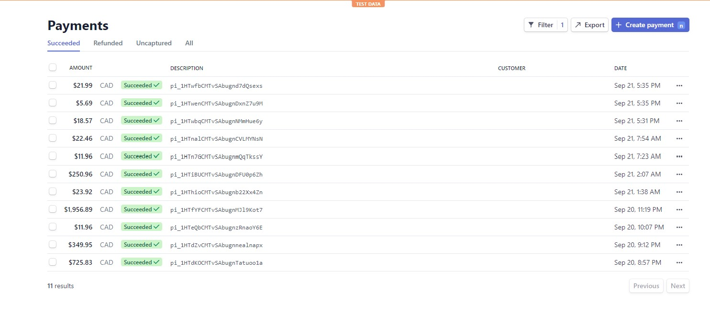
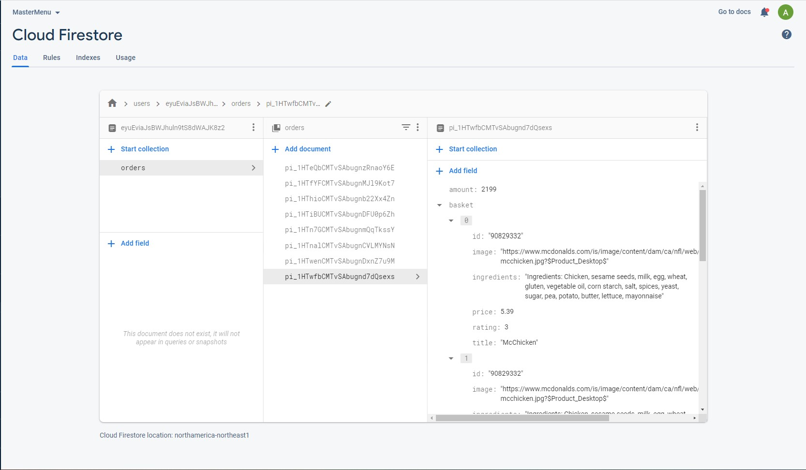

<div align="center">
  
  # Master Menu 

</div>

# Table of Contents
- [Description](#description)
- [Installation and Deployment](#installation-and-deployment)
- [Demo](#demo)

<a name="description"></a>
## Description 

### Description
Master menu is a web application that removes all the inconveniences of eating out and allows you to personalize your dining experience. It makes a digital version of every restaurant’s menu accessible all in one place, listing each menu item’s price, rating and ingredients. This allows users with allergies or dietary restrictions to know what dishes they can eat without having to ask a waiter or hoping that the menu comes with all the ingredients. Additionally, once you know which dish you would like, you can pre-order them, which notifies the restaurant to get started on your meal ahead of time, removing the inconvenience of waiting at your table for your food to come.

### Development Tools
The application utilizes a FERN (Firebase, Express, React and Node.js) stack, as well as Stripe for payment processing. The application leverages Firebase authentication, allowing users to sign up and log in. The deployed website is also hosted by Firebase and order information is stored and retrieved from Cloud Firestore databases. Moreover, the application uses React Router for routing between web pages, React Context API for state management and Axios package for sending HTTP requests. 

### Next Steps 
Currently the application has a McDonalds page as a demonstration, but in terms of Master Menu's next steps I’m looking to create a front end for restaurant owners where they can input restaurant information themselves as well as receive notifications for orders placed by customers. Another feature in development is allowing customers to input their food allergies, likes, dislikes, budget, calorie limit, etc to display the menu items in order of the user’s preferences. This would further the level of personalization and save customers from having to read through all of the menu.  

<a name="installation-and-deployment"></a>
## Installation and Deployment
This project was bootstrapped with [Create React App](https://github.com/facebook/create-react-app).

A deployed demo (with "McDonalds" page) is available at [https://master-menu-app.web.app/](https://master-menu-app.web.app/).

Installs node_modules
```
npm install
```

Runs app in development mode and open [http://localhost:3000](http://localhost:3000) to view it in the browser.
```
npm start
```

Builds the app for production to the `build` folder.<br />
It correctly bundles React in production mode and optimizes the build for the best performance to be ready for deployment
```
npm run build
```

Configure firebase and then use it for deployment
```
firebase deploy
```


<a name="demo"></a>
## Demo 
 <br/>

#### Sample payments recorded using Stripe 



#### Menu item information is stored in Cloud Firestore after payment is processed and then retrieved for page listed with all previous orders 



 


