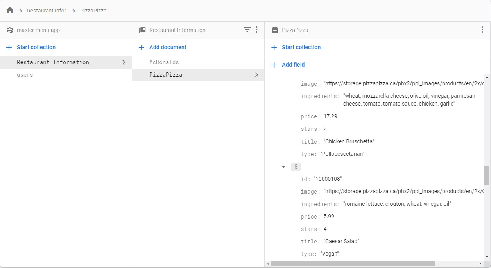

<div align="center">
  
  # Master Menu 

</div>

# Table of Contents
- [Description](#description)
- [Installation and Deployment](#installation-and-deployment)
- [Demo](#demo)

<a name="description"></a>
## Description 

### Functionality
Master Menu is a web application that removes many of the inconveniences of eating out and personalizes one's dining experience. It puts a digital version of restaurant menus in one place, listing each menu item’s price, rating, ingredients and a picture of the dish as well. Using the menu filter, users can input allergies/dietary restrictions, ingredient preferences, a budget limit, a rating minimum, as well as their diet, which includes pollopescetarian, pescetarian, vegetarian and vegan options. 
The application will take this information and highlight the food that match the user's personalized criteria. 
Once a user has decided on a dish, they can add it to their order and book a reservation, removing the inconvenience of waiting at the restaurant for their order to be taken and for their food to be made. 

### Development Tools
The application utilizes a FERN (Firebase, Express, React and Node.js) stack, as well as Stripe for payment processing. The application leverages Firebase authentication, allowing users to sign up and log in. The deployed website is also hosted by Firebase and menu/order information is stored and retrieved from Cloud Firestore databases. Moreover, the application uses React Router for routing between web pages, Context API for state management and Axios package as the HTTP client. 

<a name="installation-and-deployment"></a>
## Installation and Deployment
This project was bootstrapped with [Create React App](https://github.com/facebook/create-react-app).

A deployed demo (with sample "McDonald's" and "PizzaPizza" pages) is available at [https://master-menu-app.web.app/](https://master-menu-app.web.app/).

Installs node_modules
```
npm install
```

Runs app in development mode and open [http://localhost:3000](http://localhost:3000) to view it in the browser.
```
npm start
```

Builds the app for production to the `build` folder.<br />
It correctly bundles React in production mode and optimizes the build for the best performance to be ready for deployment
```
npm run build
```

Configure firebase and then use it for deployment
```
firebase deploy
```


<a name="demo"></a>
## Demo 
 <br/>

#### Sample payments recorded using Stripe 


#### Menu item information is stored in Cloud Firestore after payment is processed and then retrieved for page listed with all previous orders.
#### As well, all menu information is pulled from the database.  




 


