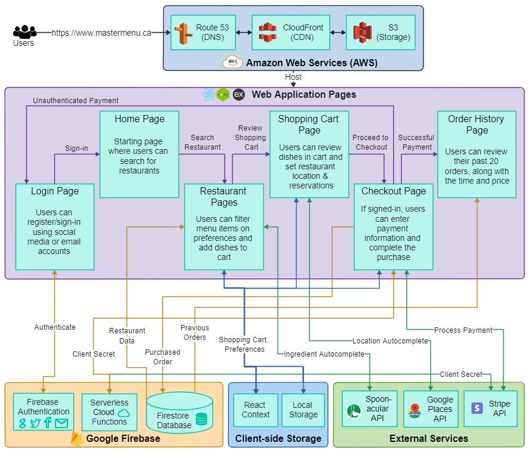

<div>
  <!--  -->
  
  
  
  
  
  
</div>

</br></br></br>

<div align="center">
  <h1 style="font-size:36px;"> Master Menu </h1>
</div>

# Table of Contents

  <ol>
    <li>
      <a style="font-size:20px;" href="#about-the-project">About the Project</a>
      <ul>
        <li><a style="font-size:16px;" href="#problem-statement"> Problem Statement </a></li>
        <li><a style="font-size:16px;" href="#summary"> Summary </a></li>
      </ul>
    </li>
    <li>
      <a style="font-size:20px;" href="#project-description-and-usage">Project Description and Usage</a>
      <ul>
        <li><a style="font-size:16px;" href="#architecture">Architecture</a></li>
        <li><a style="font-size:16px;" href="#description">Descripiton</a></li>
        <li><a style="font-size:16px;" href="#demo-and-images">Demo and Images</a></li>
        <li><a style="font-size:16px;" href="#features">Features </a></li>
        <li><a style="font-size:16px;" href="#built-with">Built With</a></li>
      </ul>
    </li>
    <li>
      <a style="font-size:20px;" href="#getting-started">Getting Started</a>
      <ul>
        <li><a style="font-size:16px;" href="#installation">Installation</a></li>
        <li><a style="font-size:16px;" href="#development">Development</a></li>
        <li><a style="font-size:16px;" href="#deployment">Deployment</a></li>
      </ul>
    </li>
    <li><a style="font-size:20px;" href="#roadmap">Roadmap</a></li>
    <li><a style="font-size:20px;" href="#contact">Contact</a></li>
  </ol>

# About the Project

A deployed demo (with sample "McDonald's" and "PizzaPizza" pages) is available at [https://www.mastermenu.ca](https://www.mastermenu.ca/) (as well as [https://master-menu-app.web.app/](https://master-menu-app.web.app/)).

## Problem Statement

This application was originally inspired by some of the problems I noticed around the inconveniences of eating out at restaurants, especially as a student:

1. The time wasted being seated, ordering and waiting for food to be cooked. Although you can order food by delivery, this comes at an additional cost and does not apply on occassions where table service / restaurant ambience is desired.
2. Having to worry about your allergies and dietary restrictions when eating at a new restaurant, especially with unclear paper menus
3. Being unsure what dish to order or making the wrong choice when trying out a new restaurant

## Summary

Master Menu is a Firebase, React web application that minimizes the aforementioned inconveniences of eating out and personalizes one's dining experience. Primarily, it provides a digital version of restaurant menus in one place that users can search through, where each menu item’s details (e.g. price, ingredients) are listed. Using the menu filter, users can input allergies/dietary restrictions, ingredient preferences, diet (e.g. vegan, vegetarian), etc and the food that best matches the user's criteria will be highlighted. Once a user has decided on a dish, they can add it to their cart, pre-order it, and book a reservation time, so that the dish would be ready on their arrival.

# Project Description and Usage

## Architecture



## Description

The following is a general description of the application that complements the diagram above, along with the application's usage and design decisions. The application leverages a FERN stack (i.e. Firebase, Express, React, Node), along with Amazon Web Services for hosting, Stripe for payment processing and Google Places & Spoonacular API for autocomplete functionality.

Primarily, Amazon Web Services are used to host the application, using Route 53 for DNS services, CloudFront for CDN services and S3 for file storage. When users visit the secure domain, CloudFront pulls the web application files from S3 buckets, and delivers the files to the appropriate IP address to create the webpage for users. As well, CloudFront provides caching services to avoid having to pull the files from S3 on every request, ensuring a low latency.

Next, Firebase facilitates user authentication and allows users to create an account or sign in using their existing social media accounts (e.g. Google, Facebook, Github), which is required for purchases. On the home page, users can search for restaurants (e.g. McDonalds and Pizza Pizza), which will take them to the individual restaurant page.

All restaurant data (e.g. dish prices, ingredients, images) is retrieved from Firestore and presented using product components. Users can then input their personal preferences (e.g. diet, allergies/dietary restrictions) to highlight the product components that best suit their needs. When typing ingredients, the autocomplete is generated from Spoonacular APIs, where the current typed string is sent in the request and possible ingredients that match the query are sent back in the response and cached for optimization. The user can then add products to their shopping cart. The filter input is stored in React Context so that it is remembered when rendering/accessing new restaurant pages. The shopping cart items are also stored in React Context to make it easier to access across the app (many components need it) and it is also stored in Local Storage so that the cart products are remembered when revisiting or refreshing the page, as shown in the demo.

Once finished shopping, users can use the header component to navigate to the shopping cart page to review the selected items. Note that the header component is on the restaurant, shopping cart, checkout and order history pages and allows for navigation to most other pages. But, the links between pages in the diagram just show the general paths that users will follow for simplicity, not what is only possible. The products are retrieved from React Context/Local Storage and then presented as product components, along with the subtotal. Users can remove products and then are required to put a location and reservation time for each restaurant. While filling the location, the current string is sent on requests to the Google Places API, and the typographically closest establishments are in the response back, which is used to create the location autocomplete dropdown. Finally, once set, the user can proceed to the checkout page.

Once again the cart products are retrieved from React Context/Local Storage. On page load, a request is sent, to the Firebase serverless functions, which then sends a request to Stripe APIs for a client secret and once received, relays it back to the frontend for use. Note that the API request is conducted through the backend since security is the priority. The API requests used in autocompletes are conducted from the frontend since speed is the priority there and security is handled in alternate ways. Users can then fill out the payment information in the Stripe Card Element component, which will then use the client secret to process the payment (this is done using the test Stripe Keys currently). But in the case that the user is not authorized, they will instead be redirected to the login page when attempting to pay. After a successful payment, the order will be sent to the Firestore database and stored under the specific user. The user will also be notified of the payment and be redirected to the order history page, where they can see their past purchases and verify that their most recent purchase has been processed. The order history page retrieves the past 20 orders from the Firestore database and displays them using order components. This page will be empty if the user is not signed in, as they will not have a stored history.

## Demo and Images

 <br/>

Demo the app yourself (with sample "McDonald's" and "PizzaPizza" pages) at <https://www.mastermenu.ca>.

<h3> Sample image of the Firestore database and of Stripe payment transactions</h3>
<p width="100%" float="left" text-align="center">
  
  
</p>

## Features

The following includes a detailed list of implemented features/details:

- Shopping cart products are cached and therefore remembered after closing the tab
- Initial website render time is under 1.5 seconds on desktop through image management, preloading and CDN caching
- Restaurant pages are completely dynamic, and only require data to be stored in Firestore for a new page to be generated
- Implemented notification system that is responsive to user actions (sign-in, sign-out, purchasing, etc) and restricts/warns users in case of errors
- Supports user sign-ins through Google, Facebook, Twitter, Github or Email account authentication
- Allows users to access the name, price, rating, ingredients and visuals of all dishes from searcheable restaurants
- Allows users to filter dishes based on allergies/dietary restrictions, ingredient preferences, rating minimums, diet or budget limitations
  - The diet options consist of pollopescatarian, pescatarian, vegetarian, vegan and none options
  - Allergies/dietary restrictions and ingredient preferences fields support autocomplete functionality (cached for optimization)
- Allows users to review their shopping cart products and remove items
- Allows users to input their reservation time and the location of the restaurant
  - The location field supports autocomplete functionality
  - Location is also protected by validation logic
- Implemented payment authorization and processing
- Allows authorized users to retrieve order history
- Uses a secure and certified transfer protocol (HTTPS)

## Built With

Languages

- JavaScript
- HTML
- CSS

Development Tools/Libraries/Frameworks

- React
  - React Router
  - React Context
  - React DOM
- Firebase
  - Firebase Authentication
  - Firestore (Database)
  - Serverless Cloud Functions
- AWS
  - S3
  - CloudFront
  - Route 53
  - Certificate Manager
  - IAM
- NodeJS
- Express
- Github Actions

External Services

- Stripe
- Google Places API
- Spoonacular API

Notable Node Packages

- Axios
- Dotenv
- React FirebaseUI
- React Places Autocomplete
- React Select
- React Toastify

# Getting Started

## Installation

This project was bootstrapped with [Create React App](https://github.com/facebook/create-react-app).<br />
In order to run the application, you will have to generate a firebase project and set the configuration. Make sure to decide on a URL to deploy on and set-up the environment variables in the .env files accordingly.

Installs node_modules

```bash
npm install
```

The following personal API keys will also have to be acquired and set to their corresponding environment variables in .env files:

- Firebase API Key
- Stripe (Publishable and Secret) API Keys
- Google Cloud Platform (Places & Maps) API Key
- Spoonacular API Key

Note that in order to set up the user authentication through social media accounts, it requires generating your own ID and Secret Keys for the corresponding social media and setting it up in the firebase authentication console.

## Development

In order to run the app (frontend) locally, which will open [http://localhost:3000](http://localhost:3000), run:

```bash
npm run start
```

In order to locally run the Firebase Functions (backend), navigate to the directory of the functions folder and run:

```bash
firebase serve
```

This is currently set to run at [http://localhost:5001/master-menu-app/us-central1/api](http://localhost:5001/master-menu-app/us-central1/api). <br />
Finally, you will have to change the axios base URL to the corresponding local backend environment variable.

You can then locally test changes to your frontend and backend triggers accordingly.

Miscellaneous:

- For Google Places API, set your domain access restrictions to include your localhost url when testing locally
- For Facebook authentication, one is required to generate a separate set of credentials for local and remote server testing (and switch out the values as needed)
- The Spoonacular API and Google Places API, when using the free plan, have a quota on the number of allowed requests sent per day and month respectively to be aware of

## Deployment

Builds the app for production to the `build` folder.<br />
It correctly bundles React in production mode and optimizes the build for the best performance to be ready for deployment

```bash
npm run build
```

Configure firebase and then use it for deployment

```bash
firebase deploy
```

# Roadmap

Currently, I consider the application complete in terms of its purpose as an educational project.
However, in order to turn this into a fully functional product, the next steps would be:

- Developing a separate interface for restaurant owners to input their menus and recieve order updates/reservations
- Rework the home page to also allow search by location and have pages specific to each restaurant location
- Potentially automate franchise page creation through public APIs or web scraping
- More sophisticated menu filtering/sorting options and dish ordering flexibility corresponding to the restaurant
- Allow for more consumer interaction, for example voting on dishes (later sort based on this) or favouriting restaurants/dishes
- Functionality for filtering restaurants, in addition to dishes
- Implementing new diets and adding logic to categorize dishes automatically
- Replace all test and limited free account API Keys

# Contact

Ayush Warikoo - Message me through email or linkedin!

<a href="ayush.warikoo77@gmail.com">
  
<a href="https://www.linkedin.com/in/ayushwarikoo">
  
